# 💸 DollarBillStearn-FrontEnd

## 📘 Table of contents
1. [What is this](#-what-is-this)
2. [Features](#%EF%B8%8F-features)
3. [How to install](#%EF%B8%8F-how-to-install)
4. [How to use](#%EF%B8%8F-how-to-use)
5. [Improvements Ideas](#-improvements-ideas)
6. [Screenshots](#%EF%B8%8F-screenshots)

### 💸 What is this
- This is an assets performance tracker, this is meant to be for private use

### ⚡️ Features
- Watch the markets: Prices for all possible tickers
- Favourite tickers: Fav tickers for each wallet
- Trade your exchange accounts from here: The app supports Binance for now
- You can have more than one account per wallet connected
- You can open limit orders and watch those and past orders

### ⚙️ How to install
- Clone this repo: `git clone https://github.com/RolandoDrRobot/MonsterCapital-FrontEnd.git`
- Go to `dollar-bill` and `npm install`
- Run `npm run start`
- Open `http://localhost:3000/`

### ⚙️ How to use
- The app shows a cover screen when wallet is not connected
- The app supports Ethereum wallets (Rinkeby and testnets) and Polygon (and Mumbai)

### 📘 Improvements Ideas
- (Screen home) Create BTC bags NFT for Identified investors
- (Screen NFTs) Incorporate NFTs vaults (accounts) to track collectibles performance

### 🐛 Tech debt
- Refactor the APP
- Need to triple check what is done

### ⚡️ Screenshots
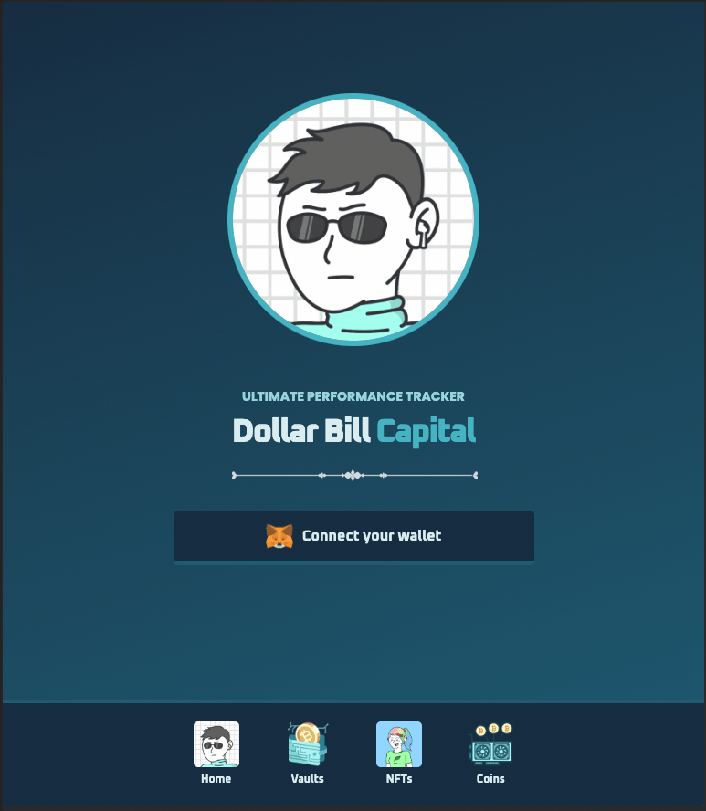
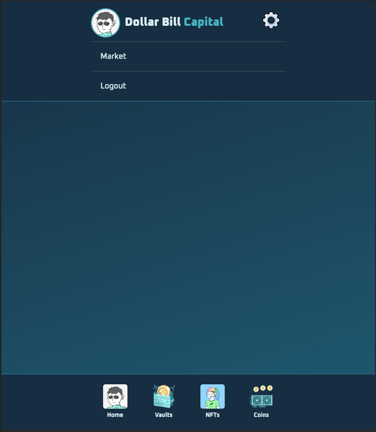
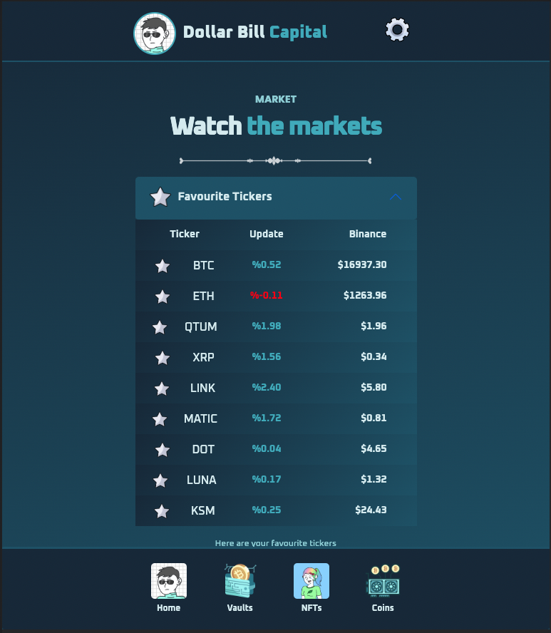

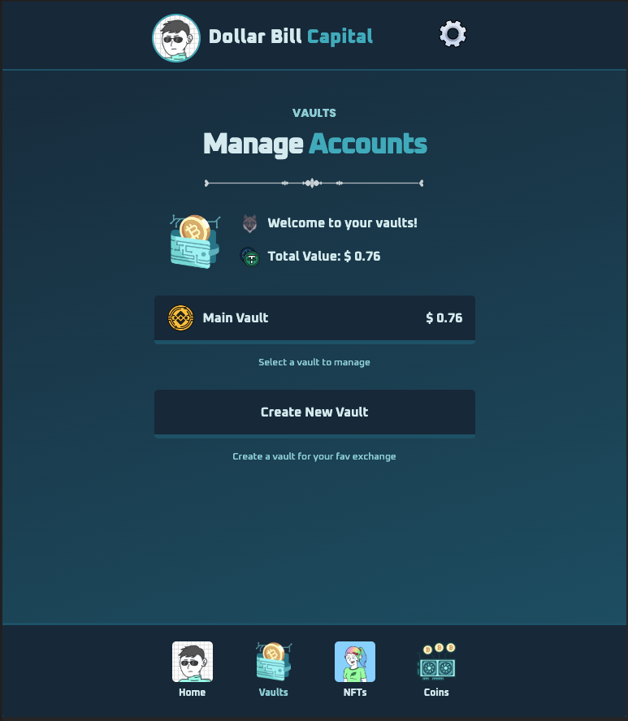
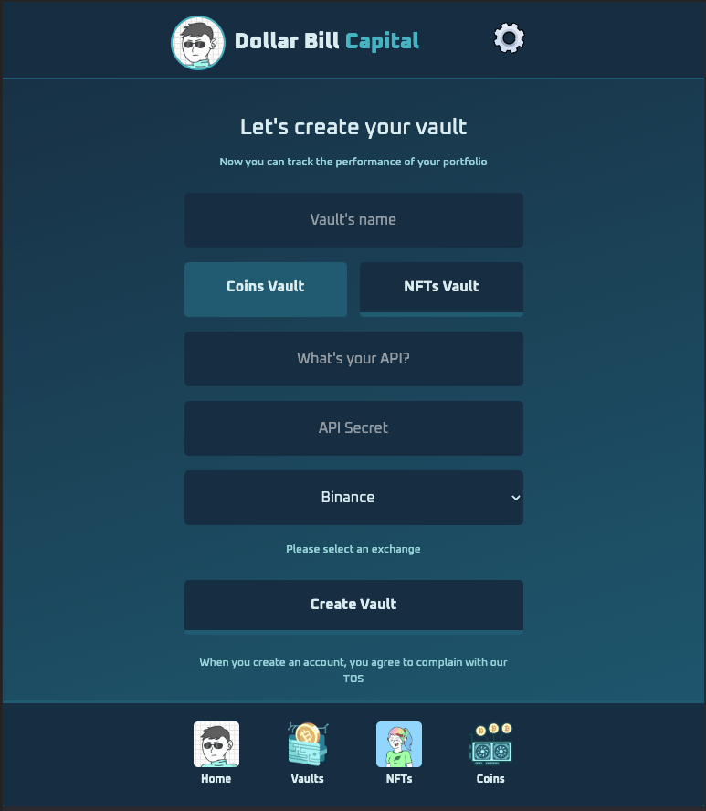
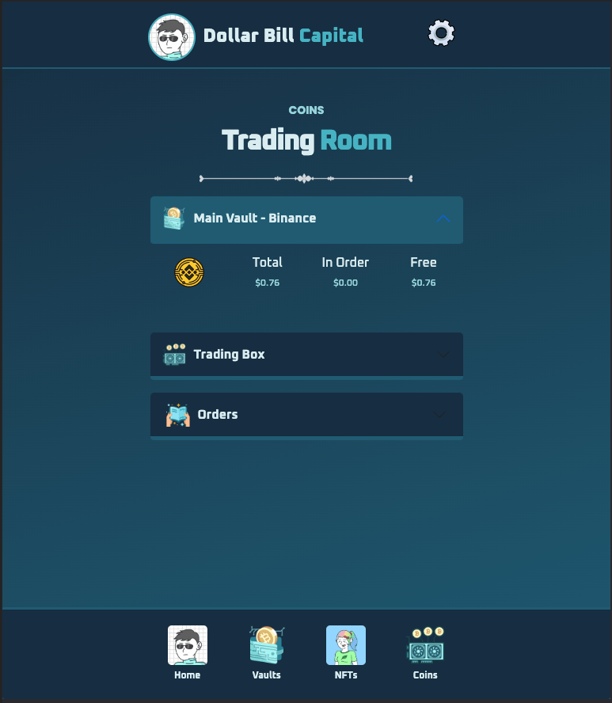
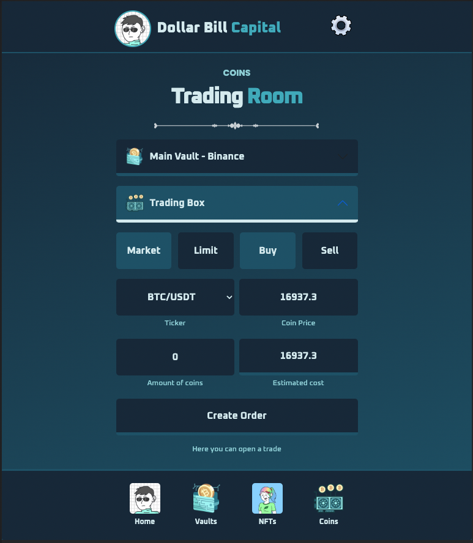
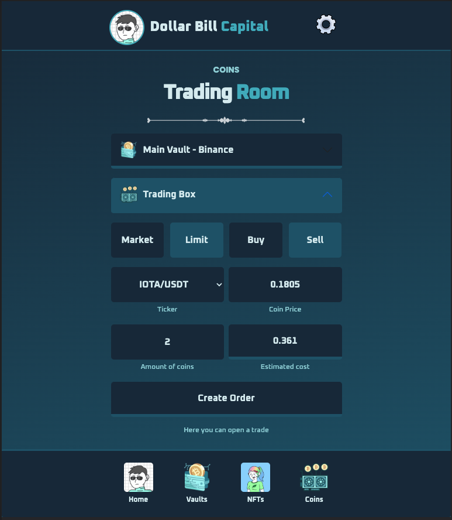
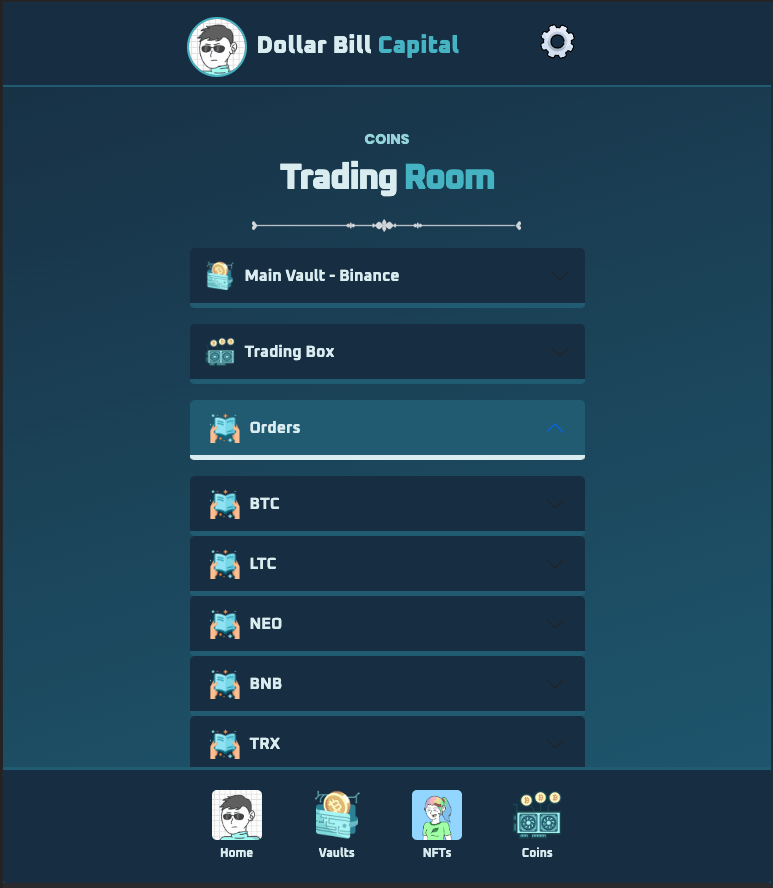
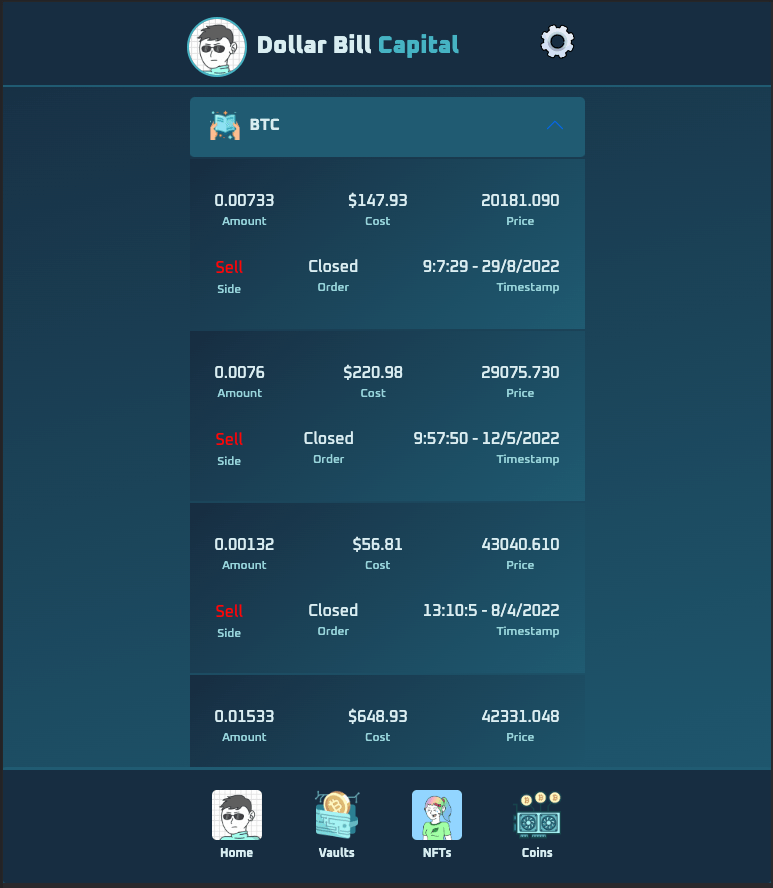
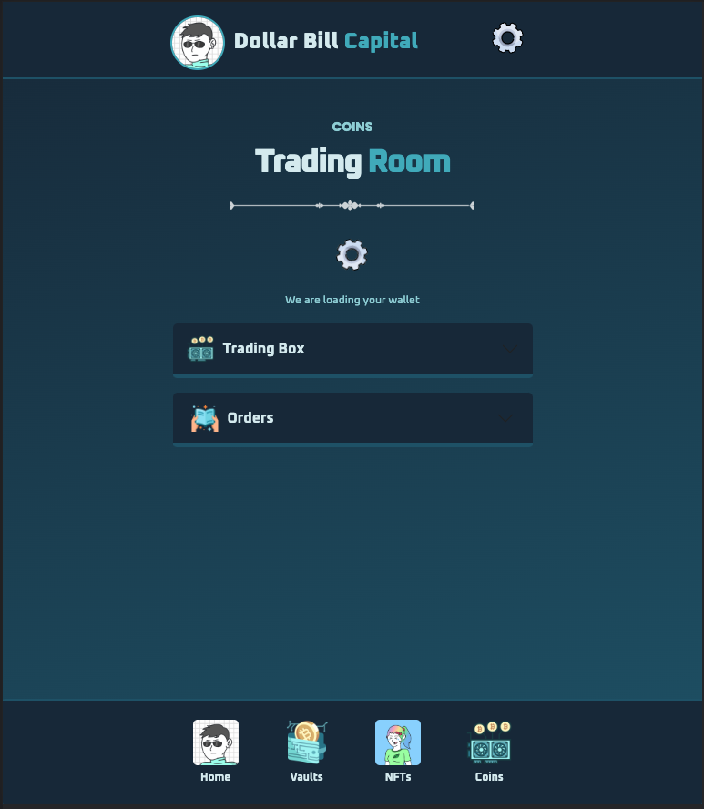
