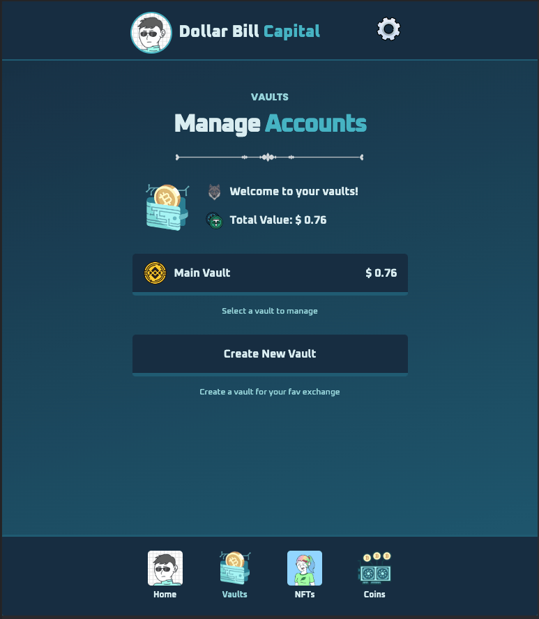
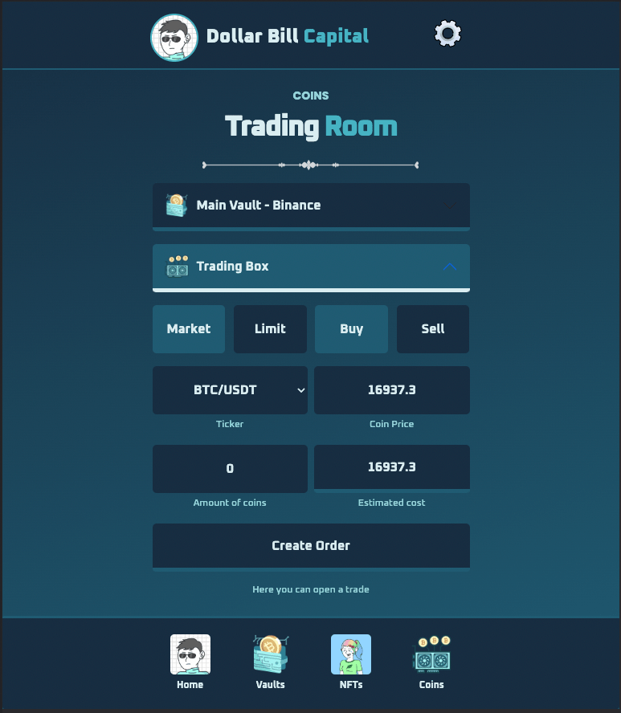
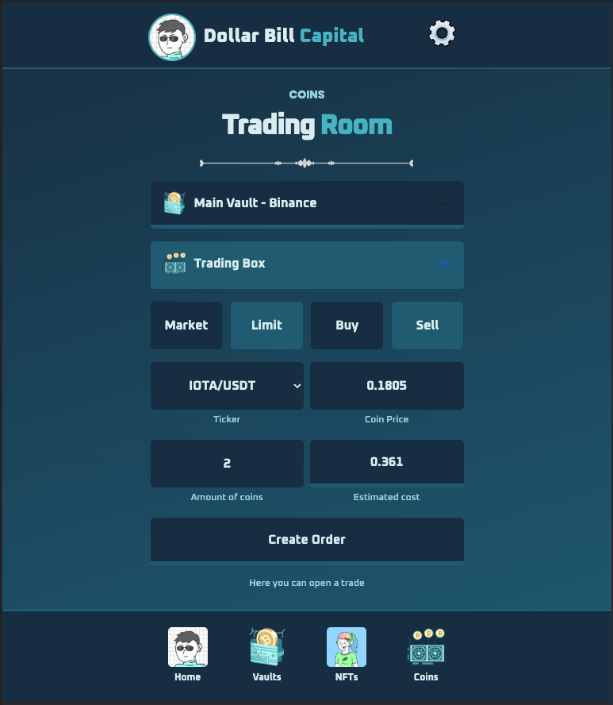
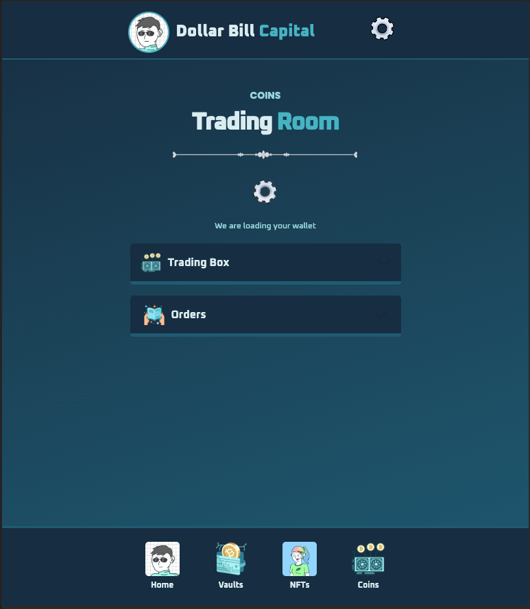

# ⚡️ MonsterCapital-FrontEnd

## 🔮 Table of contents
1. [What is this](#-what-is-this)
2. [Features](#%EF%B8%8F-features)
3. [How to install](#%EF%B8%8F-how-to-install)
4. [How to use](#%EF%B8%8F-how-to-use)
5. [Improvements Ideas](#-improvements-ideas)
6. [Screenshots](#%EF%B8%8F-screenshots)

### 🪙 What is this
- This is an assets performance tracker, this is meant to be for private use
- 

### ⚡️ Features
- 

### ⚙️ How to install
- Clone this repo: `git clone https://github.com/RolandoDrRobot/MonsterCapital-FrontEnd.git`
- Go to `dollar-bill` and `npm install`
- Run `npm run start`
- Open `http://localhost:3000/`

### ⚙️ How to use
- 

### 🔮 Improvements Ideas
- 

### 🐝 Tech debt
- 

### ⚡️ Screenshots

